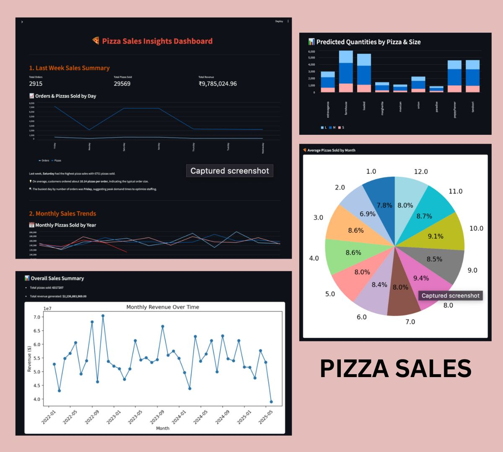

# 🍕 PizzaSalesIQ – Big Data Inventory Forecasting & Sales Analysis

**PizzaSalesIQ** is a data-driven business intelligence dashboard designed to help pizza outlets minimize inventory waste and improve demand forecasting. Built using a synthetic POS dataset, this project provides actionable insights on customer behavior, popular items, sales trends, and inventory needs using **time series forecasting** and **interactive visualizations**.

---

## 🛠️ Tech Stack & Tools

- **Python** (Pandas, Streamlit)
- **AWS S3** – cloud-based data storage
- **AWS Athena** – scalable querying over large datasets
- **Streamlit** – dashboarding and data visualization
- **Exponential Smoothing** – time series prediction
- **Jupyter Notebook** – data exploration and cleaning
- **Data Processing** – Cleaning, Grouping, Forecasting

---

## 📊 Features & Highlights

- 🔍 Analyzed POS data (sales, sizes, types, timestamps)
- 📈 Forecasted weekly inventory using Exponential Smoothing
- 📊 Interactive Streamlit dashboard for real-time insights
- 🧠 Data-driven business suggestions:
  - Most sold: **Farmhouse** 🍕 → Stock high-demand ingredients
  - Top revenue: **Loaded pizza** → Promote as combo
  - Preferred size: **Medium** → Adjust packaging strategy
  - Peak hours/months: **Lunch, Dinner / August, October** → Guide pricing & staffing
  - Discounts peak: **Weekends** → Run targeted promotions
- ☁️ Used **AWS Athena** for efficient querying and **S3** for storage

---

## 📸 Preview

---

## 🧾 About the Dataset

In many pizza outlets, excess inventory and inaccurate demand forecasting lead to significant food wastage. Due to the lack of data-driven planning, stores often overstock ingredients or underprepare during peak times, resulting in expired inventory, lost revenue, and increased operational costs.

In a real-world scenario, similar detailed transaction data can be directly retrieved from the Point of Sale (POS) system of a pizza store or restaurant. POS systems typically capture item-level sales information including order details, pizza variants, sizes, quantities, prices, discounts, and timestamps, enabling comprehensive sales and customer behavior analysis.

Thus, while this dataset is a curated composite, it faithfully represents the kind of data that a pizza outlet would collect daily via its POS system for operational and analytical purposes.

---

### 📚 Dataset Introduction & Explanation

This dataset is a synthetic mixture compiled from various online sources such as **Kaggle** and other public data repositories. It has been carefully structured and cleaned to simulate a realistic pizza sales dataset.

By leveraging historical order data from Point-of-Sale (POS) systems, we can analyze **weekly, seasonal, and event-based demand trends**. With the help of **predictive analytics and forecasting models**, stores can estimate their upcoming week's inventory requirements more accurately.

- 🧾 **Total Records**: ~1.4 million rows  
- 📁 Columns include order_id, pizza_name, pizza_size, quantity, price, discount, date, time, and contextual flags

---

## 🧮 Key Columns Snapshot

| Column Name      | Data Type  | Description                                                                 |
|------------------|------------|-----------------------------------------------------------------------------|
| `order_id`       | String     | Unique order ID; multiple pizzas per order                                 |
| `pizza_name`     | String     | Name of pizza variant (e.g., Farmhouse)                                     |
| `pizza_size`     | String     | Size of pizza (S, M, L)                                                     |
| `quantity`       | Integer    | Number of pizzas ordered                                                    |
| `price`          | Float      | Unit price per pizza                                                        |
| `total_bill_amount` | Float  | Total amount for the order                                                  |
| `discount`       | Float      | Discount value applied                                                      |
| `discount_type`  | String     | Type of discount (e.g., weekend, festival)                                  |
| `is_holiday`     | Boolean    | Flag if the date was a holiday                                              |
| `is_weekend`     | Boolean    | Flag if the order was on a weekend                                          |
| `is_friday_night`| Boolean    | Flag for Friday night orders                                                |
| `is_festival`    | Boolean    | Flag for festival day                                                       |
| `order_date`     | Date       | Date of the order (YYYY-MM-DD)                                              |
| `order_time`     | Time       | Time of the order (HH:MM:SS)                                                |

---

## 🙋‍♀️ Author

<table>
  <tr>
    <td>
      <strong>Ishita Amin</strong> 
      👩‍💻 B.Tech CSE @ Navrachana University 
      📬 <a href="mailto:aminishita30@gmail.com">aminishita30@gmail.com</a> 
      🔗 <a href="https://linkedin.com/in/ishitaamin" target="_blank">LinkedIn</a> 
    </td>
  </tr>
</table>

---

> 🚀 Use this as a starting point to build real-world demand forecasting tools or integrate dashboards into retail decision-making systems.
